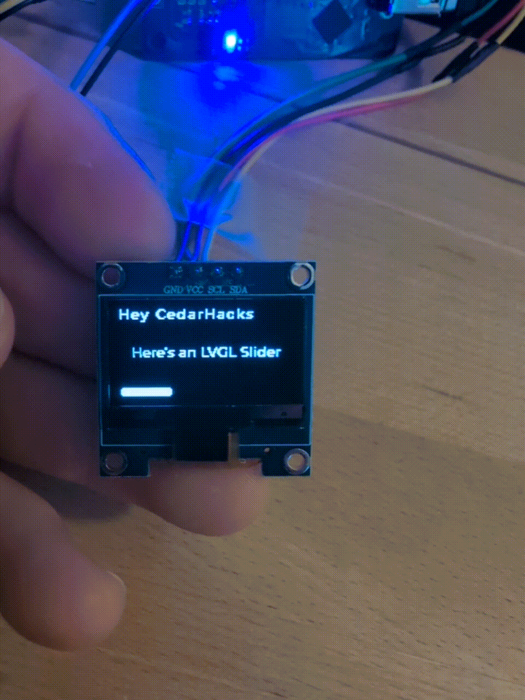
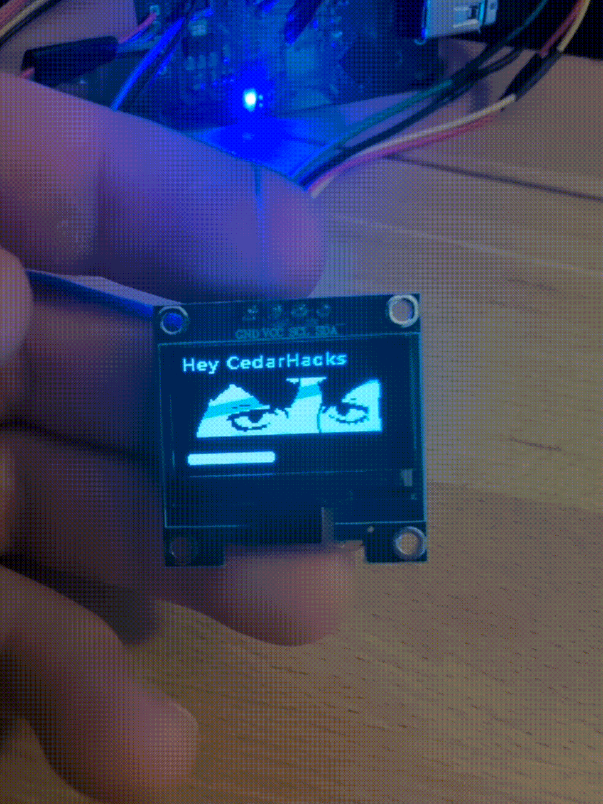

# SSD1306 Drivers

## Description

A small .c/.h file combo that initializes the display and lets you render a pixel buffer onto it. Lots of the fluff and display features is taken out, merge requests and modifications are welcome if you want to expand it!




<!-- 

 -->

## How to use

After you compile in the SSD1306_i2c_driver.h/.c files into your esp-idf project, you can do the following:

### About the display height
There's 2 configurations for the SSD1306 I found, a 32 pixel and 64 pixel height one:
 - If you are using the 64 pixel version you can copy the header/source files as they are. 
 - If you are using the 32 pixel version you need to change the height in the SSD1306_i2c_driver.h by changing `#define SSD1306_HEIGHT (64)` to `#define SSD1306_HEIGHT (32)`


### In your code

**Define a pixel buffer and create an SSD1306_t display object**
```c
uint8_t pixels[SSD1306_HEIGHT * SSD1306_WIDTH];
SSD1306_t display;
```

**Initialize the display object**
```c
display.i2c_data_pin = 15; // pin number for data
display.i2c_clock_pin = 16; // pin number for clock
display.i2c_freq_hz = 1000000;
display.i2c_address = 0x3C;
SSD1306_init(&display);
```

**Startup the display (Call this once)**
```c
SSD1306_setup_display(&display);
```

**Render pixels onto the display (call this to render)**
```c
SSD1306_display(&display, pixels);
```

## Using LVGL

The main file in this project shows an example of integrating LVGL with this driver, you can use it as reference to do the same. The `color_on(...)` function might need to be tuned for your purposes

To integrate the LVGL rendering into an esp32 project you can follow these steps:
 - first add lvgl as a dependency by running: `idf.py add-dependency "lvgl/lvgl^9"` 
 - You need to enable 8 bit color mode, using idf.py follow these steps:
   - run `idf.py menuconfig`
   - component config -> LVGL Configuration -> Color Settings -> RGB888
   - You need to add "driver" for i2C drivers as a requirement to the cmake in your ESP32 project as well.